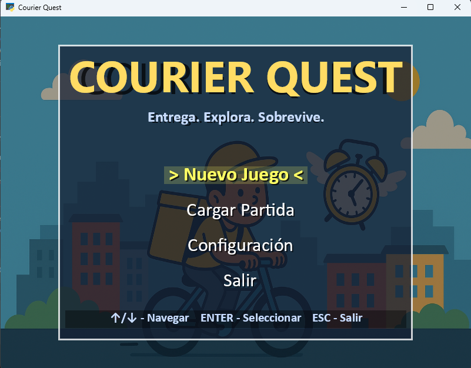
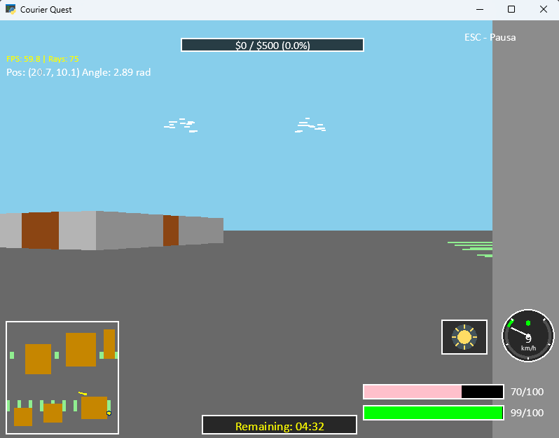
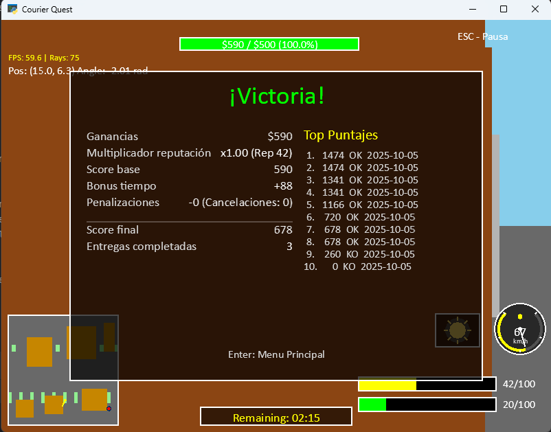
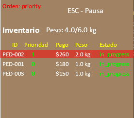
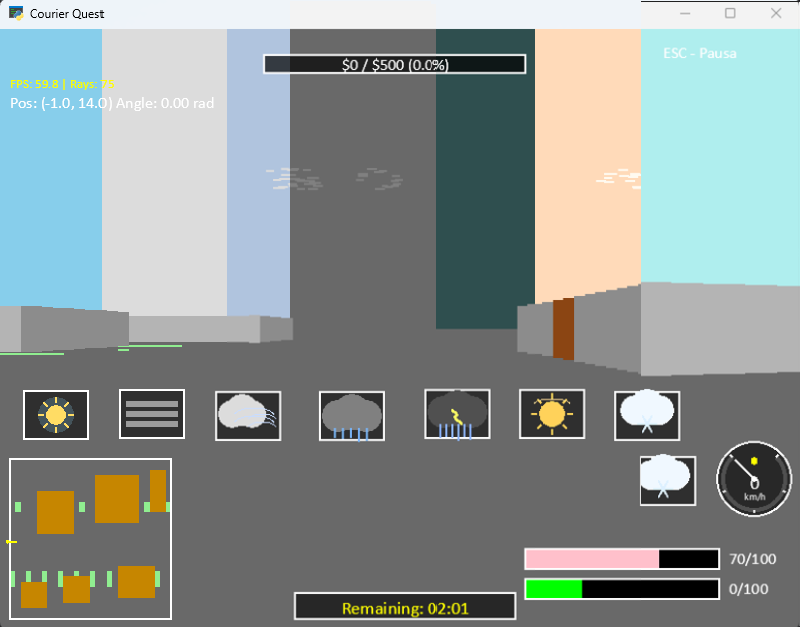

# COURIER QUEST - Proyecto de Estructuras de Datos



---

## Integrantes del Equipo

- **Brandon Brenes Umaña**
- **David González Córdoba**
- **Felipe Ugalde Vallejos**

**Curso:** EIF-207 Estructuras de Datos  
**Institución:** UNA - Universidad Nacional de Costa Rica
**Período:** II Ciclo 2025

---

## Tabla de Contenidos

1. [Descripción del Proyecto](#descripción-del-proyecto)
2. [Instalación y Requisitos](#instalación-y-requisitos)
3. [Controles del Juego](#controles-del-juego)
4. [Objetivo del Juego](#objetivo-del-juego)
5. [Mecánicas de Juego](#mecánicas-de-juego)
6. [Estructuras de Datos Utilizadas](#estructuras-de-datos-utilizadas)
7. [Algoritmos y Complejidad](#algoritmos-y-complejidad)
8. [Fórmulas Matemáticas](#fórmulas-matemáticas)
9. [API y Sistema de Caché](#api-y-sistema-de-caché)
10. [Sistema de Guardado](#sistema-de-guardado)
11. [Créditos y Licencia](#créditos-y-licencia)

---

## Descripción del Proyecto

**Courier Quest** es un videojuego desarrollado en Python utilizando la librería **Arcade 3.3.2**. El jugador controla a un repartidor en bicicleta que debe completar pedidos en una ciudad simulada, gestionando factores como tiempo de entrega, clima dinámico, resistencia física y reputación.

El proyecto implementa diversos conceptos de estructuras de datos lineales, algoritmos de ordenamiento, gestión de archivos (JSON y binarios), integración con API REST, y un sistema de ray-casting para renderizado 3D estilo Wolfenstein.



---

## Instalación y Requisitos

### Requisitos del Sistema

- **Python:** 3.8 o superior
- **Sistema Operativo:** Windows, macOS o Linux
- **Librerías necesarias:**
  - arcade==3.3.2
  - requests

### Instalación

```bash
# Clonar el repositorio
git clone https://github.com/usuario/courier-quest.git
cd courier-quest

# Instalar dependencias
pip install -r requirements.txt

# Ejecutar el juego
python main.py
```

### Estructura de Directorios

```
courier-quest/
├── api/                  # Cliente API y sistema de caché
├── assets/              # Recursos multimedia (música, imágenes)
├── data/                # Archivos de respaldo offline
├── game/                # Lógica del juego
├── saves/               # Partidas guardadas
├── api_cache/           # Caché de peticiones API
├── config.json          # Configuración del juego
└── main.py             # Punto de entrada
```

---

## Controles del Juego

### Movimiento

- **W** o **Flecha Arriba:** Avanzar hacia adelante
- **S** o **Flecha Abajo:** Retroceder
- **A** o **Flecha Izquierda:** Girar a la izquierda
- **D** o **Flecha Derecha:** Girar a la derecha

### Gestión de Pedidos

- **O:** Abrir/cerrar ventana de pedidos disponibles
- **Flecha Arriba/Abajo:** Navegar entre pedidos (en ventana de pedidos)
- **A:** Aceptar pedido seleccionado (en ventana de pedidos)
- **C:** Cancelar pedido seleccionado (en ventana de pedidos)

### Inventario

- **I:** Abrir/cerrar inventario del jugador
- **Q:** Seleccionar siguiente pedido en inventario
- **Shift + Q:** Seleccionar pedido anterior en inventario
- **Tab:** Cambiar orden de inventario (prioridad/fecha límite)

### Sistema de Deshacer

- **U:** Deshacer último movimiento/acción
- **Ctrl + Z:** Deshacer último movimiento/acción (alternativo)

### Sistema

- **ESC:** Pausar juego / Volver al menú anterior
- **F5:** Guardar partida rápida

---

## Objetivo del Juego

### Condiciones de Victoria

- Alcanzar **$500 en ganancias** antes de que se agote el tiempo límite (15 minutos de juego).

### Condiciones de Derrota

- **Reputación menor a 20:** El jugador pierde credibilidad y no puede continuar.
- **Tiempo agotado:** No se alcanzó la meta de ingresos en el tiempo límite.



---

## Mecánicas de Juego

### Sistema de Pedidos

Los pedidos se liberan de forma escalonada cada 2 minutos (configurable). Cada pedido tiene:

- **ID único:** Identificador del pedido
- **Punto de recogida (pickup):** Coordenadas donde recoger el paquete (Se muestra en el minimap)
- **Punto de entrega (dropoff):** Coordenadas donde entregar el paquete (Se muestra en el minimap)
- **Pago:** Cantidad de dinero que se recibe al completar
- **Peso:** Afecta la velocidad del jugador
- **Prioridad:** Nivel de importancia (0 = normal, n = alta prioridad)
- **Tiempo límite:** Deadline para completar la entrega



### Sistema de Resistencia (Stamina)

La resistencia del jugador varía entre **0-100**:

- **Normal (>30):** Velocidad completa
- **Cansado (10-30):** Velocidad reducida al 80%
- **Exhausto (≤0):** No puede moverse hasta recuperarse al 30%

**Consumo de resistencia:**
- Movimiento base: -0.5 por celda
- Peso extra (>3kg): -0.2 adicional por celda por cada unidad sobre 3kg
- Clima adverso:
  - Lluvia/Viento: -0.1 por celda
  - Tormenta: -0.3 por celda
  - Calor: -0.2 por celda

**Recuperación:**
- Parado: +5 puntos/segundo
- En punto de descanso: +10 puntos/segundo


### Sistema de Reputación

La reputación comienza en **70/100** y varía según las acciones del jugador:

**Cambios positivos:**
- Entrega a tiempo: +3
- Entrega temprana (≥20% antes del límite): +5
- Racha de 3 entregas sin penalización: +2 (bonus único)

**Cambios negativos:**
- Tarde ≤30s: -2
- Tarde 31-120s: -5
- Tarde >120s: -10
- Cancelar pedido aceptado: -4
- Perder/expirar paquete: -6

**Efectos de reputación:**
- **Reputación ≥90:** +5% en todos los pagos
- **Reputación <20:** Derrota inmediata


### Sistema Climático (Cadena de Markov)

El clima cambia automáticamente cada 45-60 segundos usando una **matriz de transición de Markov** de 9 estados:

**Condiciones disponibles:**
- **clear:** Despejado (velocidad ×1.00)
- **clouds:** Nublado (velocidad ×0.98)
- **rain_light:** Llovizna (velocidad ×0.90)
- **rain:** Lluvia (velocidad ×0.85)
- **storm:** Tormenta (velocidad ×0.75)
- **fog:** Niebla (velocidad ×0.88)
- **wind:** Viento (velocidad ×0.92)
- **heat:** Calor (velocidad ×0.90)
- **cold:** Frío (velocidad ×0.92)

Las transiciones entre climas son progresivas (3-5 segundos) para que los cambios se sientan naturales mediante interpolación lineal.



### Sistema de Deshacer (Undo)

El jugador puede deshacer hasta **50 pasos** anteriores:

- El sistema guarda estados cada 0.5 segundos
- Cooldown de 0.3 segundos entre undos para evitar spam
- Se guarda: posición, ángulo, stats, inventario, contadores

---

## Estructuras de Datos Utilizadas

### 1. Cola de Prioridad (Heap)

**Ubicación:** `game/game.py` - Sistema de gestión de pedidos  
**Propósito:** Gestión de pedidos con liberación escalonada basada en tiempo de juego

```python
self._orders_queue: list[tuple[float, Order]] = []  # (unlock_time_sec, Order)
```

**Operaciones:**
- Inserción: O(n log n)
- Extracción del mínimo: O(1)

**Justificación:** Permite liberar pedidos automáticamente según tiempo transcurrido sin mantener lista completa ordenada continuamente.

### 2. Cola (Queue - Lista)

**Ubicación:** `game/inventory.py` - Sistema de inventario del jugador  
**Propósito:** Gestión de pedidos activos con capacidad limitada por peso

```python
self.orders: List[Order] = []
```

**Operaciones:**
- Enqueue (agregar): O(1) + ordenamiento O(n log n)
- Dequeue (remover): O(n)

**Justificación:** Inventario FIFO con priorización dinámica mediante ordenamiento secundario por prioridad o deadline.

### 3. Conjunto (Set)

**Ubicación:** `game/renderer.py` - Sistema de renderizado  
**Propósito:** Registro de posiciones de puertas en edificios

```python
self.door_positions = set()
```

**Operaciones:**
- Inserción: O(1)
- Búsqueda: O(1)

**Justificación:** Verificación rápida de puertas durante ray casting, crítico para rendimiento a 60 FPS.

### 4. Diccionarios (Hash Maps)

#### 4.1 Caché de Minimap
**Ubicación:** `game/renderer.py`  
**Propósito:** Evitar reconstrucción del minimap en cada frame

```python
self._minimap_cache_key = None
self._minimap_shapes = None
```

**Complejidad:** O(1) para búsqueda y acceso

#### 4.2 Matriz de Transición de Markov
**Ubicación:** `game/weather.py`  
**Propósito:** Probabilidades de cambio entre 9 condiciones climáticas

```python
self.transition_matrix = {
    WeatherCondition.CLEAR: {
        WeatherCondition.CLEAR: 0.4,
        WeatherCondition.CLOUDS: 0.3,
        # ...
    }
}
```

**Complejidad:** O(1) para acceso a probabilidades

#### 4.3 Caché de Música
**Ubicación:** `game/audio.py`  
**Propósito:** Almacenar archivos de audio cargados

```python
self.music_cache = {}
```

**Complejidad:** O(1) para búsqueda y recuperación

#### 4.4 Leyenda de Tiles
**Ubicación:** `game/city.py`  
**Propósito:** Mapear tipos de casillas a propiedades de superficie

```python
self.legend = {
    "C": {"name": "calle", "surface_weight": 1.00},
    "B": {"name": "edificio", "blocked": True},
    "P": {"name": "parque", "surface_weight": 0.95}
}
```

**Complejidad:** O(1) para consultas de propiedades

### 5. Listas

#### 5.1 Frame Times
**Ubicación:** `game/game.py` - Métricas de rendimiento  
**Propósito:** Registro de tiempos de frame para cálculo de FPS

```python
self.frame_times = []  # Últimos 240 frames
```

**Operaciones:** Append O(1), pop(0) O(n)

#### 5.2 Tiles del Mapa
**Ubicación:** `game/city.py`  
**Propósito:** Matriz 2D representando el mapa

```python
self.tiles: List[List[str]] = []
```

**Acceso:** O(1) usando índices [y][x]

#### 5.3 Direcciones de Rayos (Ray Casting)
**Ubicación:** `game/renderer.py`  
**Propósito:** Cache de vectores de dirección para ray casting

```python
self._ray_dirs: List[Tuple[float, float]] = []
```

**Complejidad:** O(n) inicialización, O(1) acceso

#### 5.4 Pila de Undo (Deque)
**Ubicación:** `game/player.py`  
**Propósito:** Almacenar estados anteriores del jugador

```python
from collections import deque
self.undo_stack: deque = deque(maxlen=self.max_undo_steps)
```

**Operaciones:**
- Append: O(1)
- Pop: O(1)

**Justificación:** Deque es más eficiente que lista para operaciones en ambos extremos.

---

## Algoritmos y Complejidad

### 1. Ray Casting DDA (Digital Differential Analyzer)

**Archivo:** `game/renderer.py`  
**Complejidad:** O(w + h) donde w = ancho del mapa, h = alto del mapa  
**Contexto:** Detección de paredes para renderizado 3D

El algoritmo DDA recorre el grid del mapa de forma eficiente hasta encontrar una pared, evitando comprobar cada celda del mapa.

### 2. Renderizado de Paredes

**Complejidad:** O(n) donde n = número de rayos  
**Contexto:** Proyección de columnas de pared en pantalla

Cada rayo genera una columna vertical en pantalla, con merge horizontal de slices contiguos para reducir draw calls.

### 3. Renderizado de Piso

**Complejidad:** O(n × m) donde n = rayos, m = filas de muestreo  
**Contexto:** Texturizado del suelo con sampling espaciado

Optimización: solo se procesan filas cada `floor_row_step` píxeles para reducir cálculos.

### 4. Ordenamiento de Inventario

**Complejidad:** O(k log k) donde k = número de pedidos  
**Contexto:** Ordenar pedidos por prioridad o deadline

```python
self.orders.sort(key=lambda x: x.priority, reverse=True)  # Por prioridad
self.orders.sort(key=lambda x: x.deadline)  # Por deadline
```

### 5. Liberación Escalonada de Pedidos

**Complejidad:** O(p) donde p = pedidos pendientes de liberar  
**Contexto:** Desbloquear pedidos según tiempo transcurrido

```python
while self._orders_queue and self._orders_queue[0][0] <= elapsed:
    _, order = self._orders_queue.pop(0)
    self.pending_orders.append(order)
```

### 6. Búsqueda de Edificio Cercano

**Complejidad:** O(w × h) donde w×h = tamaño del mapa  
**Contexto:** Encontrar edificio más cercano para posicionar puertas

Búsqueda exhaustiva con optimización de distancia Manhattan para early termination.

### 7. Selección Markov de Clima

**Complejidad:** O(c) donde c = 9 condiciones climáticas  
**Contexto:** Elegir siguiente estado climático usando probabilidades

```python
def _select_next_condition(self) -> str:
    probabilities = self.transition_matrix.get(self.current_condition, {})
    # Acumulación de probabilidades y selección aleatoria
```

---

## Fórmulas Matemáticas

### 1. Velocidad Efectiva del Jugador

**Archivo:** `game/player.py` - Método `_calculate_effective_speed()`


Donde:
- `v₀`: Velocidad base del jugador (3.0 celdas/seg)
- `M_clima`: Multiplicador climático (0.75 - 1.00)
- `M_peso`: Multiplicador por peso del inventario
- `M_rep`: Multiplicador por reputación (1.03 si rep ≥90)
- `M_resist`: Multiplicador por estado de resistencia
- `w_superficie`: Peso de la superficie (parque = 0.95, calle = 1.0)

### 2. Multiplicador de Peso

**Archivo:** `game/player.py`

)

Aplicado cuando `peso_total > 3 kg`

### 3. DDA Ray Casting - Delta Distance

**Archivo:** `game/renderer.py` - Método `_cast_wall_dda()`


### 4. DDA Ray Casting - Side Distance (Inicialización)

**Archivo:** `game/renderer.py`

\times\Delta%20d_x&\text{si%20}dir_x<0\\(map_x+1-pos_x)\times\Delta%20d_x&\text{si%20}dir_x\geq%200\end{cases})

\times\Delta%20d_y&\text{si%20}dir_y<0\\(map_y+1-pos_y)\times\Delta%20d_y&\text{si%20}dir_y\geq%200\end{cases})

### 5. Distancia Perpendicular a Pared

**Archivo:** `game/renderer.py`

/2}{dir_x}\right|&\text{si%20side}=0\\\left|\frac{map_y-pos_y+(1-step_y)/2}{dir_y}\right|&\text{si%20side}=1\end{cases})

### 6. Altura de Línea de Pared

**Archivo:** `game/renderer.py`

}\right\rfloor)

### 7. Límites de Dibujo de Pared

**Archivo:** `game/renderer.py`

%20%5C%5C%0Abottom%20%3D%20%5Cmax(0%2C%20horizonte%20-%20%5Cfrac%7Bh_%7Blinea%7D%7D%7B2%7D)%0A%5Cend%7Barray%7D)

### 8. Distancia de Fila de Piso

**Archivo:** `game/renderer.py` - Método `_prepare_floor_rows()`

})

Donde:
- `posZ = altura_pantalla × 0.5`
- `y`: coordenada y de la fila en pantalla

### 9. Coordenadas Mundiales de Piso

**Archivo:** `game/renderer.py` - Método `_render_floor()`


### 10. Score Base

**Archivo:** `game/score.py` - Método `calculate_score()`


### 11. Multiplicador de Pago por Reputación

**Archivo:** `game/score.py`


### 12. Bonus por Tiempo

**Archivo:** `game/score.py`


### 13. Penalizaciones

**Archivo:** `game/score.py`


### 14. Score Final

**Archivo:** `game/score.py`

)

### 15. Interpolación Lineal (LERP)

**Archivo:** `game/utils.py` - Función `lerp()`

=a+t\times(b-a))

Usado para transiciones suaves de clima y colores.

### 16. Normalización de Ángulo

**Archivo:** `game/utils.py` - Función `normalize_angle()`


### 17. Distancia Euclidiana

**Archivo:** `game/game.py` - Método `_distance_player_to()`

^2+(y_2-y_1)^2})

Usada para verificar proximidad entre jugador y puntos de recogida/entrega.

### 18. Clamp (Restricción de Rango)

**Archivo:** `game/utils.py` - Función `clamp()`

=\begin{cases}min&\text{si%20}x<min\\max&\text{si%20}x>max\\x&\text{en%20otro%20caso}\end{cases})

Usada para limitar valores de stamina y reputación entre 0-100.

---

## API y Sistema de Caché

### Endpoints Utilizados

**Base URL:** `https://tigerds-api.kindflower-ccaf48b6.eastus.azurecontainerapps.io`

- **GET /city/map:** Obtener datos del mapa de la ciudad
- **GET /city/jobs:** Obtener lista de pedidos disponibles
- **GET /city/weather:** Obtener información de ráfagas climáticas

### Sistema de Caché

**Archivo:** `api/cache.py`

El sistema implementa un caché inteligente con:

- **TTL (Time To Live) configurable por recurso:**
  - Mapa: 24 horas (datos estáticos)
  - Pedidos: 30 minutos (actualizaciones frecuentes)
  - Clima: 15 minutos (cambios dinámicos)

- **Backup automático offline:** Todos los datos de la API se guardan en `/data/` para modo sin conexión.

- **Limpieza automática:** El caché se limpia cuando excede 100MB o contiene entradas expiradas.

**Flujo de peticiones:**

1. Verificar conexión a Internet
2. Si online: Petición a API → Guardar en caché → Guardar backup offline
3. Si offline: Cargar desde caché → Si no existe, cargar desde backup


---

## Sistema de Guardado

### Guardado Binario

**Archivo:** `game/saveManager.py`

El juego utiliza **formato binario (pickle)** para guardar partidas:

- **Archivo principal:** `saves/savegame.sav`
- **Backup automático:** `saves/savegame_backup.sav`
- **Autosave:** `saves/autosave.sav`

### Datos Guardados

- **Jugador:** Posición, ángulo, stamina, reputación, ganancias
- **Ciudad:** Dimensiones, tiles del mapa, meta de ingresos
- **Pedidos:** Estado de todos los pedidos (activos, completados, cancelados)
- **Estadísticas:** Tiempo jugado, entregas completadas, tiempo restante
- **Inventario:** Lista de pedidos aceptados con todos sus atributos

### Funcionalidades

- **Guardado rápido (F5):** Guarda en cualquier momento durante el juego
- **Guardado desde menú de pausa:** Opción "Guardar Partida"
- **Carga desde menú principal:** Detecta automáticamente si existe partida guardada
- **Sistema de respaldo:** Tres niveles de seguridad (principal, backup, autosave)

---

## Sistema de Puntuación (Leaderboard)

### Cálculo de Puntaje

El puntaje final se calcula al terminar una partida (victoria o derrota):

```
score_base = ganancias × multiplicador_reputación
bonus_tiempo = score_base × 0.15 (si victoria y tiempo_restante ≥ 20%)
penalizaciones = cancelaciones × 25
score_final = max(0, score_base + bonus_tiempo - penalizaciones)
```

### Leaderboard

**Archivo:** `saves/scores.json`

- Guarda las **50 mejores puntuaciones**
- Ordenadas de mayor a menor
- Incluye: timestamp, score, victorias/derrotas, estadísticas


---

## Estructura del Código

### Módulo `api/`

- **client.py:** Cliente HTTP para consumir API REST
- **cache.py:** Sistema de caché con TTL y limpieza automática

### Módulo `game/`

- **game.py:** Bucle principal del juego, estados, lógica de victoria/derrota
- **player.py:** Lógica del jugador, movimiento, stats, sistema de undo
- **city.py:** Representación del mapa, validación de posiciones
- **renderer.py:** Ray casting, renderizado 3D, minimap
- **weather.py:** Sistema climático con cadena de Markov
- **inventory.py:** Gestión de inventario del jugador
- **orders.py:** Clases Order y OrderManager
- **ordersWindow.py:** Interfaz de ventana de pedidos disponibles
- **audio.py:** Administrador de música y efectos de sonido
- **gamestate.py:** Máquina de estados (menús, pausa, jugando)
- **saveManager.py:** Guardado/carga de partidas en formato binario
- **score.py:** Sistema de puntuación y leaderboard
- **settings.py:** Menú de configuración
- **utils.py:** Funciones auxiliares (lerp, clamp, distancias)

---

## Configuración

El archivo `config.json` permite modificar:

- **Resolución de pantalla**
- **Número de rayos (calidad gráfica)**
- **Volumen de música**
- **Velocidad del jugador**
- **Tiempo límite de partida**
- **Mecánicas de reputación**
- **Parámetros del sistema de deshacer**
- **Intervalos de liberación de pedidos**

>FOTOMENUCONFIG<

---

## Tecnologías y Librerías

- **Python 3.8+:** Lenguaje de programación
- **Arcade 3.3.2:** Motor de juego 2D/3D
- **Requests:** Cliente HTTP para API REST
- **JSON:** Formato de datos para configuración y caché
- **Pickle:** Serialización binaria para guardados

---

## Licencia

Este proyecto está bajo la **Licencia MIT**.

```
MIT License

Copyright (c) 2025 David González Córdoba

Permission is hereby granted, free of charge, to any person obtaining a copy
of this